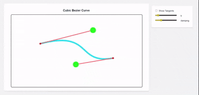

# Interactive Cubic Bézier Curve Editor



An interactive editor for cubic Bézier curves with spring-damped physics, responsive design, and touch support.

## Mathematical Model

### Cubic Bézier Curve

The curve is defined by four points: P₀, P₁, P₂, and P₃, where:
- P₀ and P₃ are the endpoints (anchors)
- P₁ and P₂ are the control points that define the curve's shape

The curve is calculated using the cubic Bézier formula:

```
B(t) = (1−t)³P₀ + 3(1−t)²tP₁ + 3(1−t)t²P₂ + t³P₃
```

where t varies from 0 to 1.

### Tangent Lines

The tangent at any point t is calculated using the derivative:

```
B'(t) = 3(1−t)²(P₁−P₀) + 6(1−t)t(P₂−P₁) + 3t²(P₃−P₂)
```

This gives us the slope of the tangent line at point t. To calculate the actual endpoints of the tangent line segment:

1. First, we find the point on the curve at parameter t using B(t)
2. Calculate the angle θ from the slope: θ = arctan(slope)
3. Calculate the endpoints at distance d/2 in both directions:
   ```
   startPoint = {
     x: point.x - (d/2) * cos(θ)
     y: point.y - (d/2) * sin(θ)
   }
   endPoint = {
     x: point.x + (d/2) * cos(θ)
     y: point.y + (d/2) * sin(θ)
   }
   ```
   where d is the desired length of the tangent line

Tangent lines are drawn at regular intervals (t = 0.1, 0.2, ..., 0.9) to visualize the curve's direction. The length of these tangent lines scales with the view to maintain visual consistency.

## Physics Model

The control points (P₁ and P₂) use a spring-damped physics system for smooth interaction:

### Spring-Mass-Damper System

- Spring constant (k): Controls the "stiffness" of movement (default: 0.1)
- Damping coefficient: Controls oscillation decay (default: 0.25)
- Physics update equation:
  ```
  acceleration = -k * (position - target) - damping * velocity
  velocity += acceleration * dt
  position += velocity * dt
  ```

### Collision Handling

- Soft boundary collisions with 0.8 restitution coefficient
- Prevents control points from leaving the canvas area

## Design Choices

### Architecture

The code is organized into four main modules:

1. **Math (math.js)**
   - Pure mathematical functions
   - Bézier curve calculations
   - Geometric utilities

2. **System (system.js)**
   - Physics simulation
   - State management
   - Scaling and parameters

3. **View (view.js)**
   - Canvas rendering
   - Visual styles
   - Drawing operations

4. **Controller (controller.js)**
   - Input handling
   - Animation loop
   - UI binding
   - Resize handling

## Interaction Model

- Drag control points (P₁, P₂) to modify curve shape
- Physics simulation creates smooth, natural movement
- Adjustable physics parameters via UI sliders
- Optional tangent line visualization

